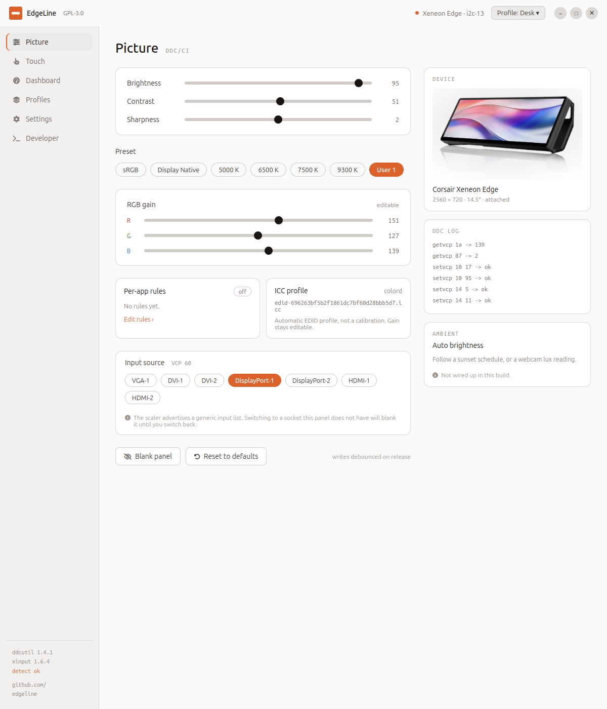
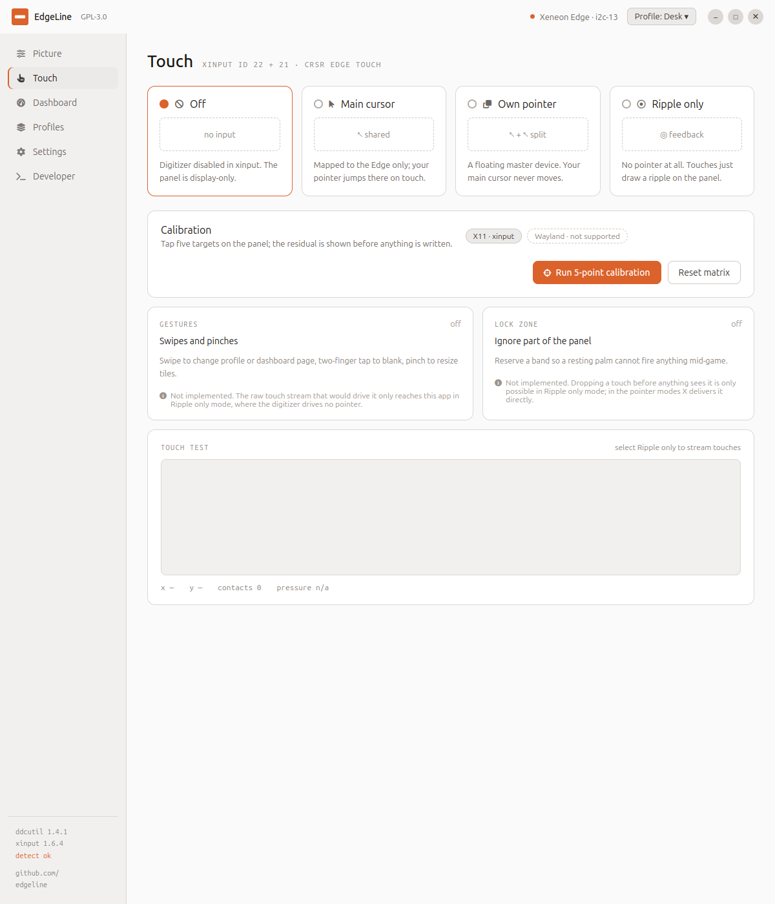
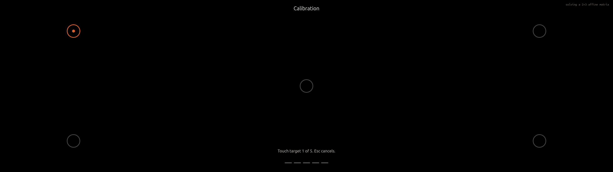
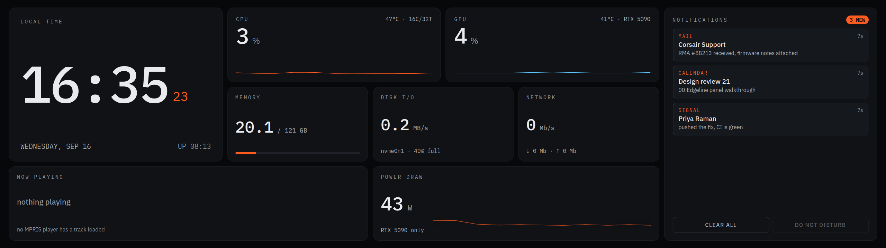
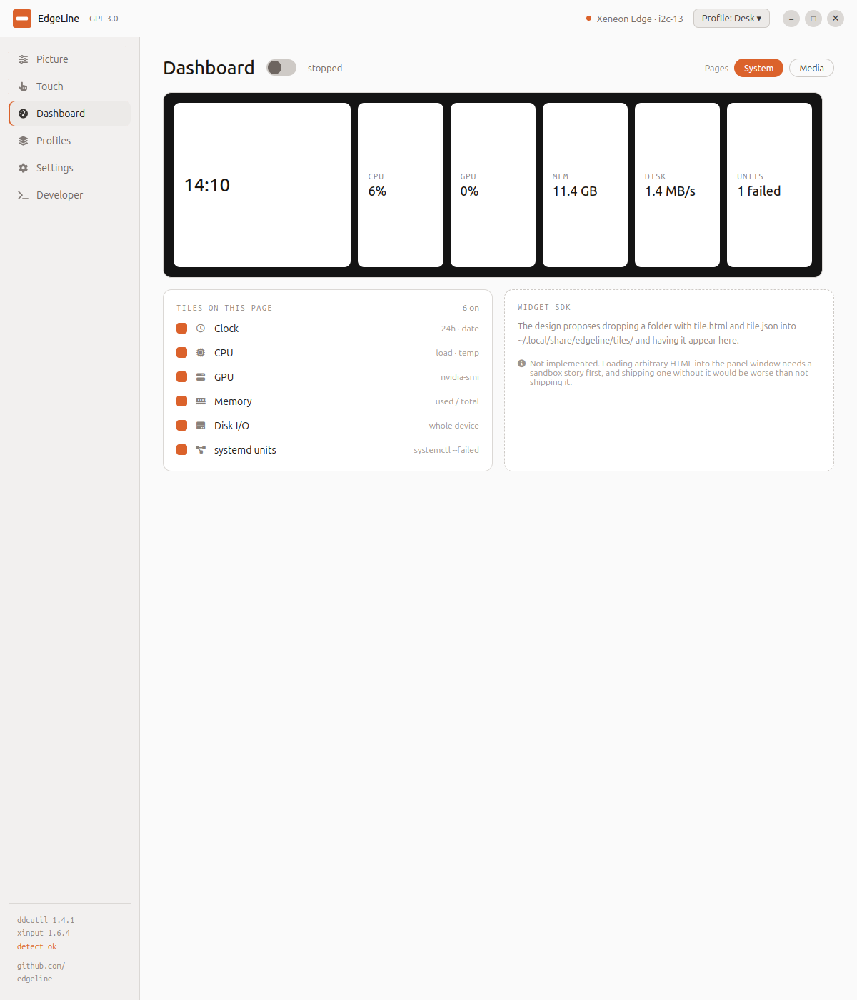
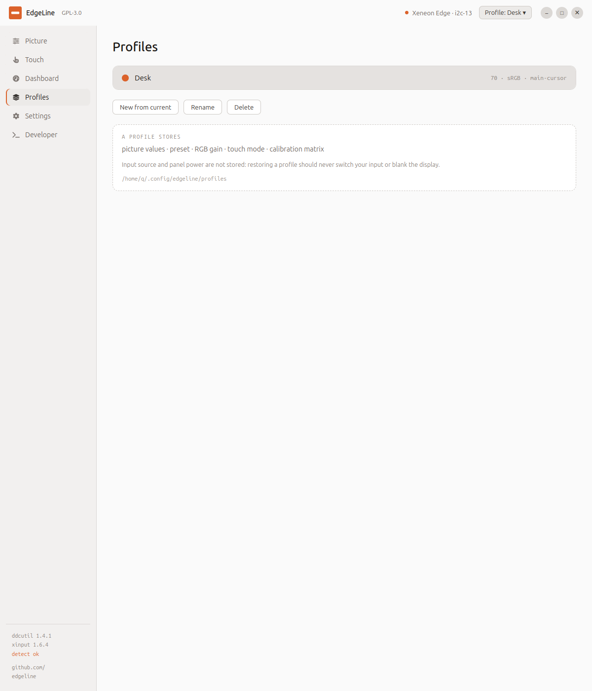
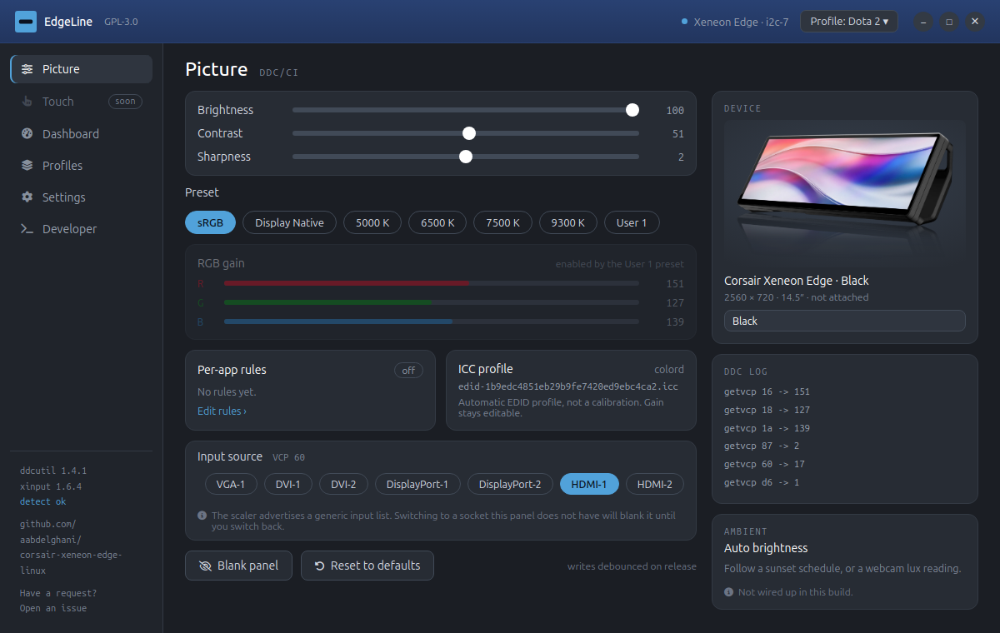

# EdgeLine

Native Linux control for the **Corsair Xeneon Edge**, the 14.5 inch 2560x720
touchscreen strip that ships with no Linux software at all. Corsair's iCUE is
Windows only and will not run under Wine, so the panel arrives on Linux as an
expensive letterbox: no picture control, and a digitizer that maps across your
whole desktop and drags your cursor with it.

EdgeLine fixes both, and then puts something worth looking at on the strip.



GPL-3.0. No kernel module, no root daemon. Picture control goes through
`ddcutil`, touch through `xinput`, and the agent runs as your own user.

---

## What it does

### Picture, from the panel's own capabilities

Brightness, contrast, sharpness, colour presets, per channel RGB gain, input
source, blanking, and the panel's own restore-defaults commands.

Every control is built from what the panel reports over DDC/CI, not from a
fixed list. That matters more than it sounds. On this hardware the design
mock-up and the panel disagree three times, and the panel wins every time:

| Control | Assumed | This panel actually reports |
| --- | --- | --- |
| Sharpness | 0 to 10 | maximum of 4 |
| Colour presets | four | seven, and gain unlocks on "User 1" |
| Input source | USB-C and HDMI | seven sources, none of them USB-C |

The input list is shown as reported, with a note that the scaler is advertising
a generic list and that picking a socket the panel does not have will blank it.
RGB gain follows the panel too: it is only editable under the preset that
accepts it, because every other preset drives the channels itself and a write
would be silently ignored.

### Touch, four ways



- **Off** — the digitizer is disabled and the panel is display only.
- **Main cursor** — mapped to the Edge, so your pointer jumps there on touch.
- **Own pointer** — a second X pointer for the Edge; your main cursor never moves.
- **Ripple only** — no pointer at all, just a ripple where you touch.

Plus a five point calibration that runs on the panel itself.



It reports its residual error **before** writing anything, so a bad run can be
redone rather than silently becoming your new calibration.

The panel does full multi touch on Linux: `hid-multitouch` binds generically and
15 simultaneous contacts are advertised, 10 measured. None of that needs a quirk
or a udev rule. The details, including what to write if you are porting Edge
support to another OS, are in [docs/TOUCH.md](docs/TOUCH.md).

### A dashboard on the strip



Clock, CPU, GPU, memory, disk, network and failed systemd units, sized for a
panel you read from across a desk rather than a preview thumbnail. Choose which
tiles appear:



### Profiles and per-app rules



A profile stores picture values, preset, RGB gain, touch mode and the
calibration matrix. It deliberately does **not** store input source or panel
power: restoring a profile should never switch your input or black out the
display.

Rules apply a profile when a chosen window takes focus, matched on `WM_CLASS` or
on a window state such as `_NET_WM_STATE_FULLSCREEN`. First match wins. When
nothing matches and you have set no fallback, the panel is left alone rather
than reset, so alt-tabbing to a terminal does not fight you.

### Four themes

Ubuntu and Fedora, light and dark. It follows your desktop's preference until
you pick one. The screenshots above are Ubuntu light; here is Fedora dark:



---

## Install

Download the `.deb` from
[Releases](https://github.com/aabdelghani/corsair-xeneon-edge-linux/releases):

```sh
sudo apt install ./edgeline_0.4.0_amd64.deb
```

Then, once:

```sh
sudo usermod -aG i2c "$USER"     # picture control needs i2c access
```

and log out and back in. The package installs a udev rule for the HID
interface, but group membership is not something a package can grant on your
behalf.

An AppImage is also attached to the release if you would rather not install
anything.

## Use it from a terminal

The command line talks to the same agent the window does, so the two cannot
fight over the panel.

```sh
edgeline status                    # panel, DDC and touch state
edgeline set brightness 40
edgeline get contrast
edgeline reset colour              # factory | brightness | colour
edgeline touch mode own-pointer    # off | main-cursor | own-pointer | ripple
edgeline touch --live 15           # measure real simultaneous contacts
edgeline probe                     # read-only HID reconnaissance
edgeline update-check              # exits 10 when an update exists
```

Values are checked against the panel's real maximum first, so `set sharpness 9`
is refused with the actual limit instead of failing somewhere inside ddcutil.

---

## How it is put together

```
agent/     C++17, Qt Core only. Owns every device. No windows.
ui/        Electron 33, vanilla HTML/CSS/JS. Owns no hardware.
packaging/ deb build, desktop entry, AppStream metadata, icons.
docs/      TOUCH.md, PROTOCOL.md.
```

One process owns the panel and everything else asks it to. They speak
newline-delimited JSON over `$XDG_RUNTIME_DIR/edgeline.sock`, which means the
whole agent can be driven from a shell:

```sh
printf '{"id":1,"method":"ddc.set","params":{"code":16,"value":40}}\n' \
  | socat - UNIX-CONNECT:$XDG_RUNTIME_DIR/edgeline.sock
```

That is not just a debugging convenience. It keeps agent bugs and interface
bugs separable, and it is how most of this was tested before any of the
interface existed.

The renderer runs with `contextIsolation`, no Node integration and the sandbox
on. Its content security policy allows no remote origins at all: fonts and icons
are bundled, so the app renders identically offline and on a machine with no
Ubuntu fonts installed.

### Build from source

```sh
cmake -S agent -B agent/build -DCMAKE_BUILD_TYPE=Release
cmake --build agent/build -j"$(nproc)"
(cd agent/build && ctest)

nvm use 20            # the system Node is older than Electron 33 wants
(cd ui && npm ci && npm start)

./packaging/deb/build.sh
```

The test suites use a `CHECK` macro rather than `assert`, because `assert`
compiles out under `NDEBUG` and a Release build would otherwise report a green
run having verified nothing.

---

## Updates

On launch the app asks GitHub once a day whether a newer release exists and
shows a notice if there is one. It downloads nothing, installs nothing and runs
nothing: the notice links to the release page and you decide.

It sends only the request, has no analytics of any kind, can be skipped per
version, and can be turned off in Settings. Failures are silent unless you
pressed the button yourself.

---

## What this does not do

Kept here rather than left for you to discover:

- **Wayland.** The whole touch stack is `xinput` and XInput2. Picture control
  works anywhere `ddcutil` does, but the touch modes, the transformation matrix
  and the raw touch reader are X11 only.
- **Gestures and a lock zone.** Both need touches the agent sees before anything
  else does, which only happens in Ripple mode; in the pointer modes X delivers
  them straight to a pointer and there is nothing to intercept.
- **A widget SDK.** Loading arbitrary HTML into the panel window needs a sandbox
  story first.
- **Importing from iCUE.** The export format is undocumented and nobody has
  contributed a sample to work from. If you have one, open an issue.
- **Now playing and notification tiles.** They need an MPRIS reader and a D-Bus
  notification monitor respectively.
- **A D-Bus interface.** Designed as `dev.edgeline.Ctl1`, not implemented. The
  local socket above is the working equivalent.
- **Flatpak, rpm and AUR packages.** Only the `.deb` and the AppImage are built.

Each of these is visible in the interface where it would otherwise be, marked
with the reason, rather than quietly missing.

---

## Credits

Protocol facts are re-implemented from open sources; no code is copied. The HID
work cross-references OpenRGB (GPL-2) and OpenLinkHub (GPL-3), which is why this
project is GPL-3.0. See [PROTOCOL.md](PROTOCOL.md).

The Ubuntu typeface is bundled under the Ubuntu Font Licence, and Font Awesome
Free under its own terms.

Not affiliated with or endorsed by Corsair.
