# EdgeLine

Native Linux control for the **Corsair Xeneon Edge**, the 14.5 inch 2560x720
touchscreen strip that ships with no Linux software at all. Corsair's iCUE is
Windows only and will not run under Wine, so the panel arrives on Linux as an
expensive letterbox: no picture control, and a digitizer that maps across your
whole desktop and drags your cursor with it.

EdgeLine fixes both, and then puts something worth looking at on the strip.

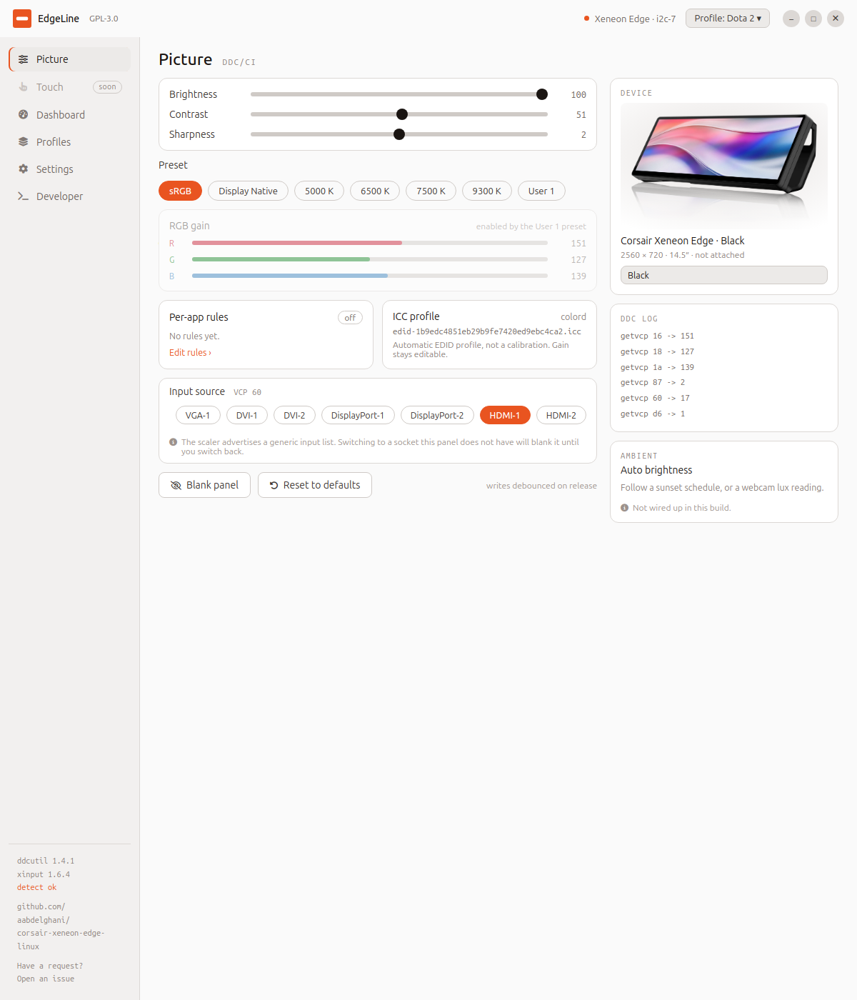

GPL-3.0. No kernel module, no root daemon. Picture control goes through
`ddcutil`, touch through `xinput`, and the agent runs as your own user.

---

## What it does

### Picture, from the panel's own capabilities

Backlight (VCP 0x10), contrast, sharpness, colour presets, per channel RGB gain, input
source, blanking, and the panel's own restore-defaults commands.

Every control is built from what the panel reports over DDC/CI, not from a
fixed list. That matters more than it sounds. On this hardware the design
mock-up and the panel disagree three times, and the panel wins every time:

| Control | Assumed | This panel actually reports |
| --- | --- | --- |
| Sharpness | 0 to 10 | maximum of 4 |
| Colour presets | four | seven, and gain unlocks on "User 1" |
| Input source | USB-C and HDMI | seven sources, none of them USB-C |

The input list is shown as reported, with a note that the scaler is advertising
a generic list and that picking a socket the panel does not have will blank it.
RGB gain follows the panel too: it is only editable under the preset that
accepts it, because every other preset drives the channels itself and a write
would be silently ignored.

### Touch, four ways

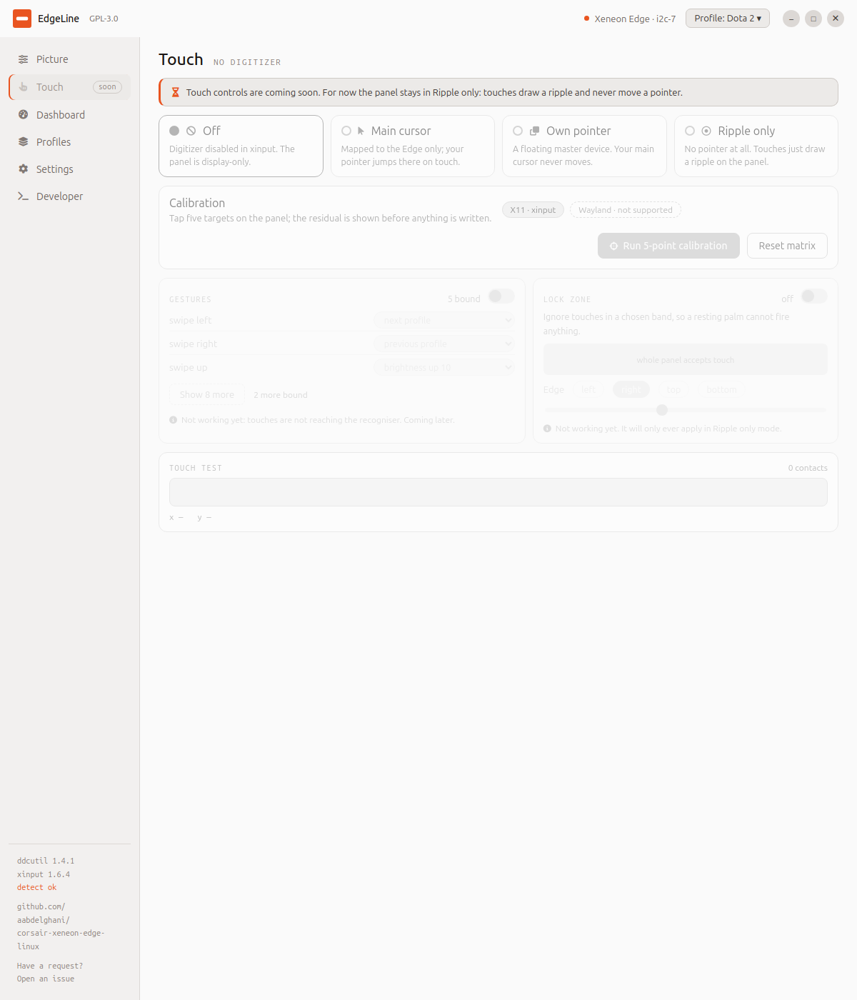

- **Off** — the digitizer is disabled and the panel is display only.
- **Main cursor** — mapped to the Edge, so your pointer jumps there on touch.
- **Own pointer** — a second X pointer for the Edge; your main cursor never moves.
- **Ripple only** — no pointer at all, just a ripple where you touch.

**Coming soon: gestures and a lock zone.** Swipes, taps, long press and pinch,
and a band along any edge where touches are ignored. Both are built and tested
in the agent, but touches do not yet reach them on the real panel, so the Touch
page shows them greyed out rather than pretending they work. For now the panel
stays in Ripple only mode.

Plus a five point calibration that runs on the panel itself.

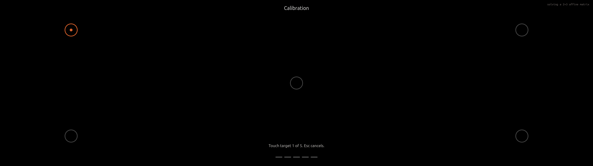

It reports its residual error **before** writing anything, so a bad run can be
redone rather than silently becoming your new calibration.

The panel does full multi touch on Linux: `hid-multitouch` binds generically and
15 simultaneous contacts are advertised, 10 measured. None of that needs a quirk
or a udev rule. The details, including what to write if you are porting Edge
support to another OS, are in [docs/TOUCH.md](docs/TOUCH.md).

### A dashboard on the strip

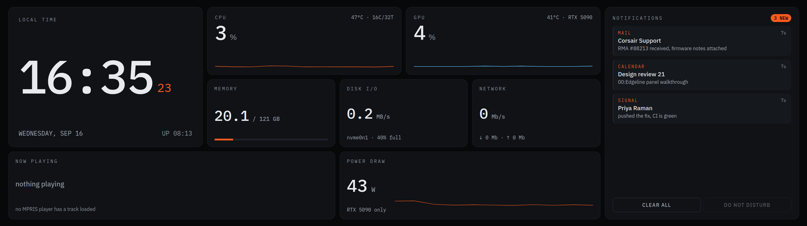

The panel draws a twelve by three grid of tiles at its native 2560x720: a large
clock with the date and uptime, CPU and GPU with rolling sparklines, memory,
disk throughput with how full the root filesystem is, network in bits, what is
playing with previous, play and pause, and next, a power draw sparkline, and
desktop notifications as they arrive.

The network tile reads one interface. Left alone it takes the busiest physical
interface whose link is up; the Dashboard page lists every interface with its
link state so you can pin one, including a bridge or tunnel if that is where
your traffic goes. Rates under a megabit are shown in kilobits rather than
rounded to zero.

Five themes, picked from a list on the Dashboard page and remembered: Night
(graphite and ember, above), Daylight (cream ground, white cards), Porcelain
(deep tan), Sage (fern green) and User, whose background, cards and text you
set yourself by picker or hex. Two pages, also picked there: System, above, and
Media, which gives now playing and notifications the room. The panel itself
carries no switcher.

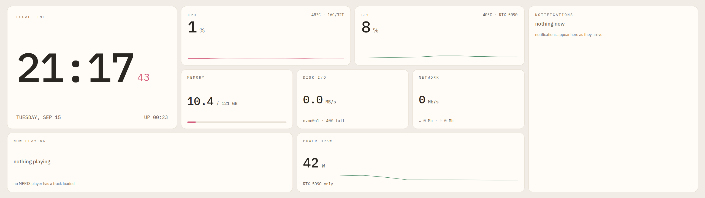

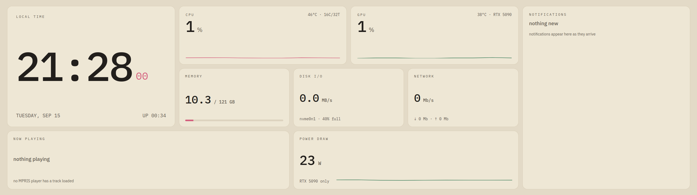

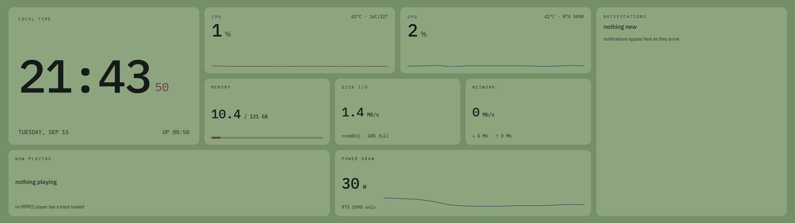

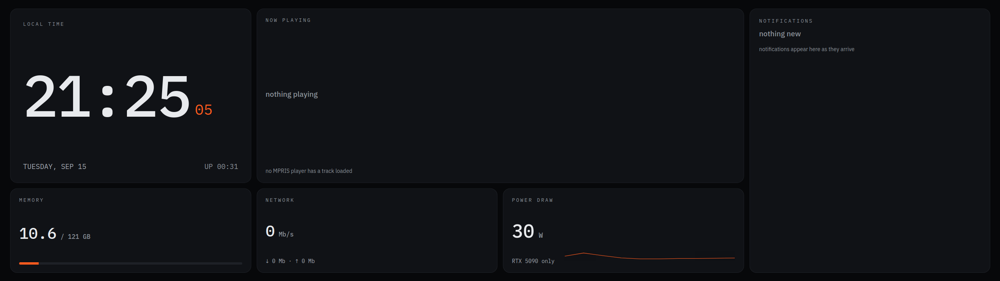

The GPU tile reads NVIDIA cards through `nvidia-smi` and AMD cards straight
from the `amdgpu` driver's sysfs files, so it needs nothing installed on an AMD
machine. Both vendors are read on every poll rather than one being a fallback
for the other, so a machine with a discrete card and an integrated one sees
both. `edgeline gpus` lists what it found, and the Dashboard page chooses what
the tile shows: one card, the other, or both at once. Left alone it shows the
card with the most VRAM.

Now playing comes from any MPRIS player on the session bus. Notifications come
from a D-Bus monitor, because a notification is a method call addressed to the
notification daemon rather than a signal, so subscribing cannot see one. That
connection is monitor only: once the bus grants it, it is forbidden from
sending anything at all, so the agent can watch notifications and nothing else.

Where this machine has no source for a figure, the tile says so rather than
showing a plausible number. Where powercap's energy counters are readable only by
root, power falls back to the GPU's own measured draw, labelled as such.
Choose which tiles appear:

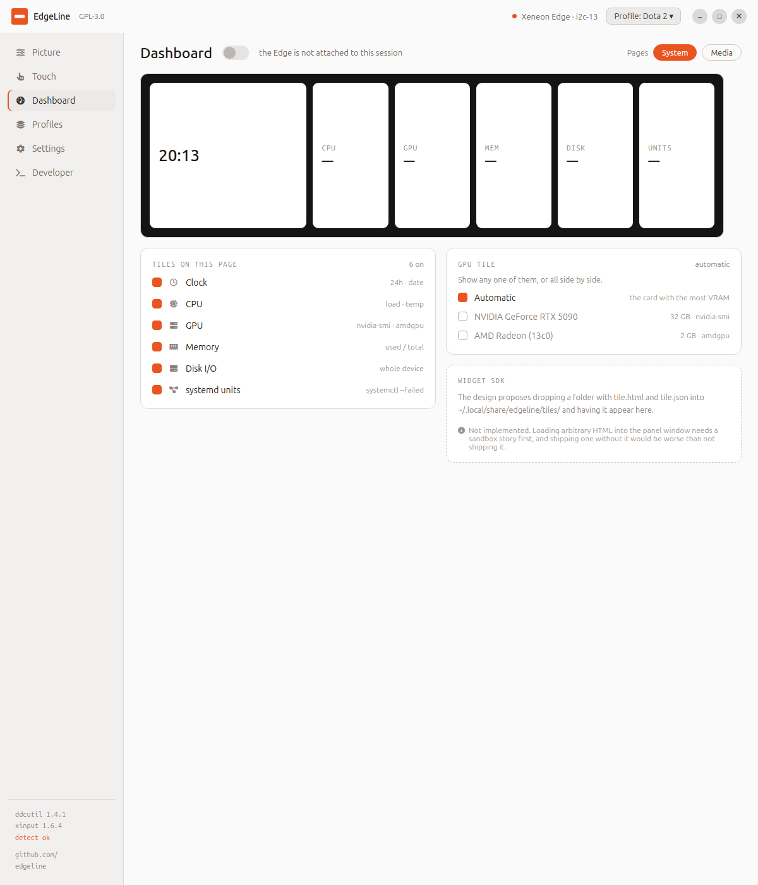

### Profiles and per-app rules

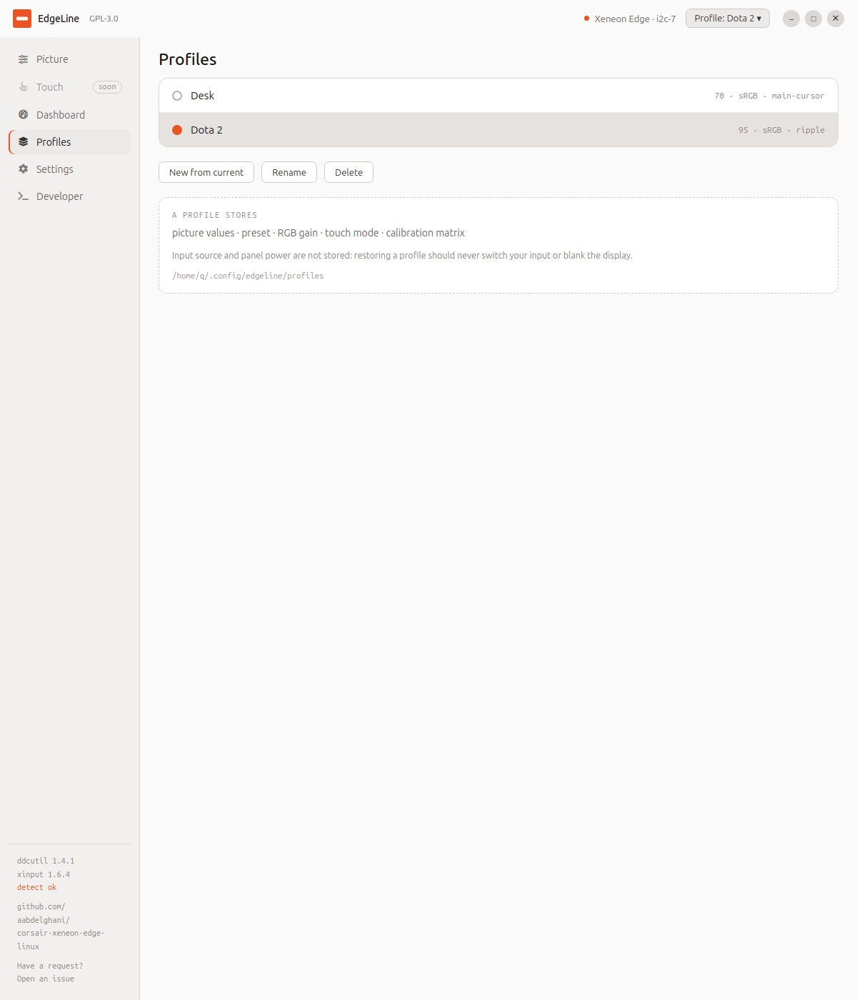

A profile stores picture values, preset, RGB gain, touch mode and the
calibration matrix. It deliberately does **not** store input source or panel
power: restoring a profile should never switch your input or black out the
display.

Rules apply a profile when a chosen window takes focus, matched on `WM_CLASS` or
on a window state such as `_NET_WM_STATE_FULLSCREEN`. First match wins. When
nothing matches and you have set no fallback, the panel is left alone rather
than reset, so alt-tabbing to a terminal does not fight you.

### Six themes

Ubuntu, Fedora and NixOS, each light and dark. By default it matches the
machine: the family comes from `/etc/os-release` (Debian based systems get
Ubuntu, RHEL based get Fedora, anything else Ubuntu), and light or dark follows
the desktop live. Pick a theme in Settings to override it, or Match system to
go back. The screenshots above are Ubuntu light; here are
Fedora dark and NixOS dark:

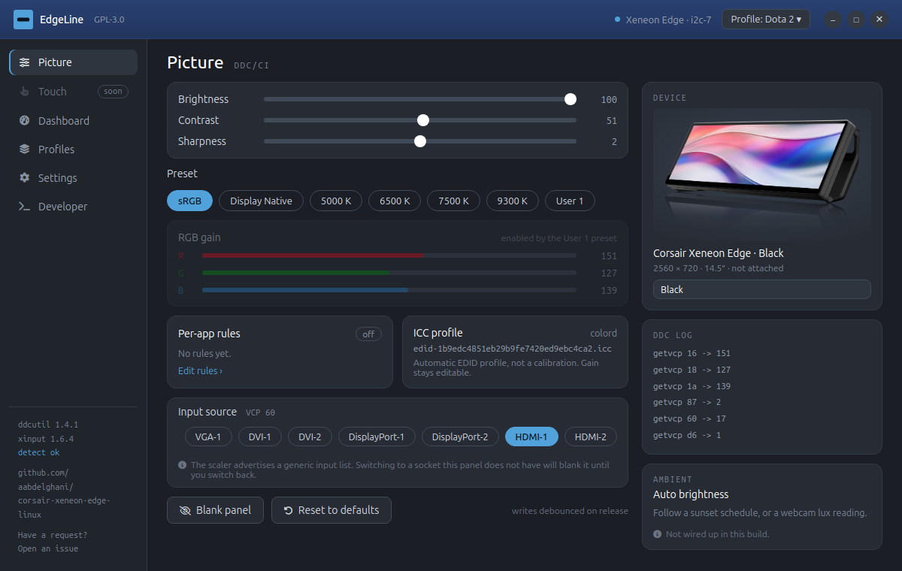

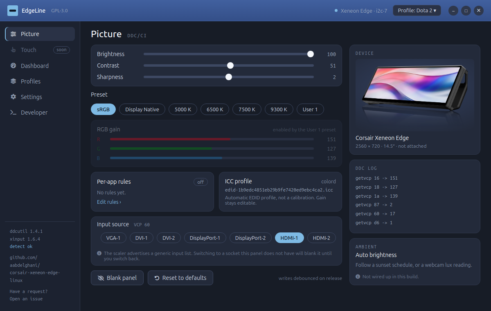

---

## Install

Download the `.deb` from
[Releases](https://github.com/aabdelghani/corsair-xeneon-edge-linux/releases):

```sh
sudo apt install ./edgeline_0.6.3_amd64.deb
```

Then, once:

```sh
sudo usermod -aG i2c "$USER"     # picture control needs i2c access
```

and log out and back in. The package installs a udev rule for the HID
interface, but group membership is not something a package can grant on your
behalf.

An AppImage is also attached to the release if you would rather not install
anything. It carries its own copy of everything the agent needs except what
every desktop has, so it runs on Ubuntu 22.04 and later, Debian 12, Fedora
and Arch, needs no libfuse2, and updates itself through AppImageUpdate. It is
listed in the [AppImage catalog](https://appimage.github.io/). Build it with
`packaging/appimage/build.sh` (needs docker).

### How the Edge is found

By resolution, never by connector name, because the connector index changes
across reboots on this hardware. An exact 2560x720 display is taken first.
Under XWayland with a fractionally scaled monitor elsewhere in the session the
Edge is reported a little off that size (2555x719 at 145%, for instance), so a
32:9 display is accepted as a fallback, but never the primary display and never
anything wider than 4000, because a 49 inch 5120x1440 or 3840x1080 monitor is
32:9 as well.

One layout that cannot be resolved by resolution alone: a 3840x1080 monitor set
as a secondary display, with no Edge attached, will be taken for the Edge. If
that is your desk, keep the dashboard switched off; the rest of the app is
unaffected.

## Use it from a terminal

The command line talks to the same agent the window does, so the two cannot
fight over the panel.

```sh
edgeline status                    # panel, DDC and touch state
edgeline set backlight 40
edgeline get contrast
edgeline reset colour              # factory | brightness | colour
edgeline touch mode own-pointer    # off | main-cursor | own-pointer | ripple
edgeline touch --live 15           # measure real simultaneous contacts
edgeline probe                     # read-only HID reconnaissance
edgeline update-check              # exits 10 when an update exists
```

Values are checked against the panel's real maximum first, so `set sharpness 9`
is refused with the actual limit instead of failing somewhere inside ddcutil.

### Driving the agent from a shell

Everything the window can do goes through one socket, so a script can too.

```sh
edgeline methods                                  # every method the agent answers
edgeline call state.all                           # result as indented JSON
edgeline call --compact ddc.set '{"code":16,"value":40}'
echo '{"name":"night"}' | edgeline call profiles.get -    # params from stdin
edgeline watch ddc device                         # pushed events, one JSON line each
edgeline profile list                             # "* " marks the active one
edgeline profile save night --overwrite           # also: show, apply, delete, rename
edgeline gain 90 95 100                           # red, green, blue in one go
edgeline status --json                            # state.all as JSON
edgeline get red --json                           # {"value":..,"max":..}
```

`call` takes the params as a JSON object (default `{}`); anything else exits
64 without sending. An error reply or a missing agent prints to stderr and
exits 3. `watch` sends no request at all and exits 0 on Ctrl-C or SIGTERM, 3
if the agent goes away.

The wire format is one JSON object per line on `$XDG_RUNTIME_DIR/edgeline.sock`
(`socat - UNIX-CONNECT:$XDG_RUNTIME_DIR/edgeline.sock` works too):

```
request   {"id":1,"method":"ddc.set","params":{"code":16,"value":40}}
response  {"id":1,"result":{...}}   |   {"id":1,"error":"..."}
event     {"event":"ddc","data":{...}}          (unsolicited)
```

Events seen from the agent: `ddc`, `ddcLog`, `device`, `touch`, `touch.point`,
`gesture`, `touchConfig`, `sensors`, `rules`, `focus`, `profiles`, `update`,
`ui.action`. Sensor and touch-point events only flow after
`edgeline call sensors.stream` / `edgeline call touch.stream` has switched them
on. That switch is global: it affects every client, the window included, and
`watch` never touches it.

Methods marked **writes** change panel or agent state. The ones in bold need
care before a script calls them.

| Method | What it does |
|---|---|
| `rpc.methods` | Lists every registered method name, sorted. |
| `system.info` | Agent and system snapshot (version and so on). |
| `state.all` | system, device, ddc, touch, sensors, rules, color and touchConfig in one reply. |
| `device.state` | Whether the panel is present and its hidraw node accessible. |
| `ddc.state` | Last known VCP values with their maxima. |
| `ddc.get` | Queues a read of VCP `code`; the value arrives as a `ddc` event. |
| `ddc.set` (**writes**) | Queues a write of `value` to VCP `code`. **`code` 0x60 (input source) can black out the panel, 0xD6 (power) can switch it off.** |
| `ddc.restoreDefaults` (**writes**) | **Panel reset by `scope`: `factory`, `brightness` or `color`. A factory or colour reset wipes the RGB gain.** |
| `touch.state` | Current touch mode and state. |
| `touch.setMode` (**writes**) | Sets `mode` (`off`, `main-cursor`, `own-pointer`, `ripple`) through xinput and saves it. |
| `touch.probe` | Read-only report of the touch stack, as `edgeline touch`. |
| `touch.stream` (**writes**) | Switches touch-point events on or off (`enabled`, default true), for every client. |
| `touch.applyOutputMapping` (**writes**) | Maps touch to the Edge's output and returns the matrix. |
| `touch.setMatrix` (**writes**) | **Applies a 9-number `matrix` to the touch device through xinput.** |
| `touch.calibrate` (**writes** only with `apply`) | **Solves a calibration matrix from `targets` and `measured` points; with `apply:true` it also writes it.** |
| `touch.config` | Gesture and touch configuration. |
| `touch.setConfig` (**writes**) | Saves the gesture bindings and touch configuration, validating the actions. |
| `settings.set` | Always refuses: autostart belongs to the interface. |
| `profiles.list` | Saved profiles with a summary, the active one and the directory. |
| `profiles.get` | The stored body of profile `name`. |
| `profiles.save` (**writes**) | Snapshots the current picture values as `name`; refuses an existing name unless `overwrite:true`. |
| `profiles.apply` (**writes**) | Applies profile `name` to the panel. |
| `profiles.delete` (**writes**) | **Deletes profile `name`.** |
| `profiles.rename` (**writes**) | Renames profile `from` to `to`. |
| `rules.get` | The per-app rules configuration. |
| `rules.set` (**writes**) | **Replaces the per-app rules (`rules`, fallback profile, enabled), which switch profiles on focus changes.** |
| `color.state` | Colour-management devices and profiles. |
| `color.setProfile` (**writes**) | Makes `profileId` the default for `deviceId` through `colormgr`. |
| `sensors.stream` (**writes**) | Switches sensor events on or off (`enabled`, `intervalMs`), for every client. |
| `sensors.interfaces` | Network interfaces and the one in use. |
| `sensors.selectInterface` (**writes**) | Saves the interface `name` for the network tile; empty means automatic. |
| `sensors.gpus` | GPUs found and the selected ones. |
| `sensors.selectGpus` (**writes**) | Saves the GPU `ids` for the dashboard; empty means automatic. |
| `media.control` (**writes**) | Sends the `action` to the media player via MPRIS. |
| `notifications.clear` (**writes**) | Clears the collected notifications. |
| `updates.check` | Starts an update check (`manual`, default true); the answer arrives as an `update` event. |
| `updates.settings` (**writes**) | Sets `enabled` and/or `skipVersion` for update checks and returns them. |
| `agent.quit` (**writes**) | **Stops the agent; the socket disappears and the panel is no longer driven until it is restarted.** |

---

## How it is put together

```
agent/     C++17, Qt Core only. Owns every device. No windows.
ui/        Electron 33, vanilla HTML/CSS/JS. Owns no hardware.
packaging/ deb build, desktop entry, AppStream metadata, icons.
docs/      TOUCH.md, PROTOCOL.md.
```

One process owns the panel and everything else asks it to. They speak
newline-delimited JSON over `$XDG_RUNTIME_DIR/edgeline.sock`, which means the
whole agent can be driven from a shell:

```sh
printf '{"id":1,"method":"ddc.set","params":{"code":16,"value":40}}\n' \
  | socat - UNIX-CONNECT:$XDG_RUNTIME_DIR/edgeline.sock
```

That is not just a debugging convenience. It keeps agent bugs and interface
bugs separable, and it is how most of this was tested before any of the
interface existed.

The renderer runs with `contextIsolation`, no Node integration and the sandbox
on. Its content security policy allows no remote origins at all: fonts and icons
are bundled, so the app renders identically offline and on a machine with no
Ubuntu fonts installed.

### Build from source

```sh
cmake -S agent -B agent/build -DCMAKE_BUILD_TYPE=Release
cmake --build agent/build -j"$(nproc)"
(cd agent/build && ctest)

nvm use 20            # the system Node is older than Electron 33 wants
(cd ui && npm ci && npm start)

./packaging/deb/build.sh
```

The test suites use a `CHECK` macro rather than `assert`, because `assert`
compiles out under `NDEBUG` and a Release build would otherwise report a green
run having verified nothing.

---

## Updates

On launch the app asks GitHub once a day whether a newer release exists and
shows a notice if there is one. It downloads nothing, installs nothing and runs
nothing: the notice links to the release page and you decide.

It sends only the request, has no analytics of any kind, can be skipped per
version, and can be turned off in Settings. Failures are silent unless you
pressed the button yourself.

---

## What this does not do

Kept here rather than left for you to discover:

- **Wayland.** The whole touch stack is `xinput` and XInput2. Picture control
  works anywhere `ddcutil` does, but the touch modes, the transformation matrix
  and the raw touch reader are X11 only.
- **A lock zone outside Ripple mode.** The band works, but only while the agent
  owns the digitizer. Raw X11 touch events can be observed and not cancelled, so
  in the pointer modes X has already handed the touch to a pointer before this
  app sees it. The interface says so where the control is.
- **A widget SDK.** Loading arbitrary HTML into the panel window needs a sandbox
  story first.
- **Importing from iCUE.** The export format is undocumented and nobody has
  contributed a sample to work from. If you have one, open an issue.
- **A D-Bus interface.** Designed as `dev.edgeline.Ctl1`, not implemented. The
  local socket above is the working equivalent.
- **Flatpak, rpm and AUR packages.** Only the `.deb` and the AppImage are built.

Each of these is visible in the interface where it would otherwise be, marked
with the reason, rather than quietly missing.

---

## Credits

Protocol facts are re-implemented from open sources; no code is copied. The HID
work cross-references OpenRGB (GPL-2) and OpenLinkHub (GPL-3), which is why this
project is GPL-3.0. See [PROTOCOL.md](PROTOCOL.md).

The Ubuntu typeface is bundled under the Ubuntu Font Licence, and Font Awesome
Free under its own terms.

Not affiliated with or endorsed by Corsair.
